<h2>TensorFlow-FlexUNet-Image-Segmentation-Kidney-Stone-Ultrasound (2026/07/18)</h2>
<h3>Kidney-Stone-Ultrasound: AI Generated Pseudo Masks Segmentation Challenge</h3>
Sarah T. Arai 
Software Laboratory antillia.com  
This is the first experiment of Image Segmentation for <b>Kidney-Stone-Ultrasound</b> based on our 
<a href="https://github.com/sarah-antillia/TensorFlow-FlexUNet-Image-Segmentation-Model">TensorFlow-FlexUNet-Image-Segmentation-Model</a> 
(TensorFlow Flexible UNet Image Segmentation Model for Multiclass), 
and a 512x512 pixels PNG 
<a href="https://drive.google.com/file/d/1qZjyCSRFsi0ZKtVeRDlbJbKN9FbqrO5U/view?usp=sharing">
<b>Augmented-Kidney-Stone-Ultrasound-ImageMask-Dataset.zip</b></a> 
(<a href="https://creativecommons.org/licenses/by-sa/4.0/">CC BY-SA 4.0</a>)
, which was derived by us from   
<b>Stone</b> subset of 
<a href="https://www.kaggle.com/datasets/imtkaggleteam/kidney-stone-classification-and-object-detection">
<b>Kidney Stone | Classification and Object Detection
</b></a> by Mohamadreza Momeni.  

<b>Actual Image Segmentation for Kidney-Stone-Ultrasound Images of 512x512 pixels </b> 
As shown below, the inferred masks predicted by our segmentation model trained by the dataset appear similar to the ground truth masks.
  
<table >
<tr>
<th>Input: image</th>
<th>Mask (ground_truth)</th>
<th>Prediction:inferred_mask</th>
</tr>
<tr>
<td>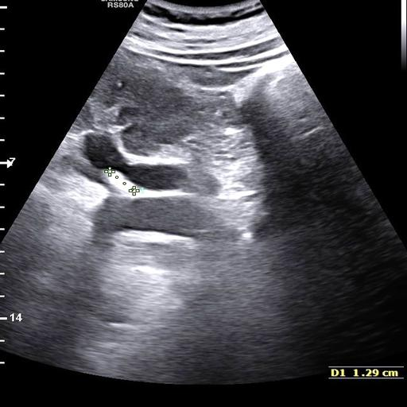</td>
<td>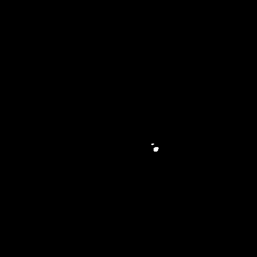</td>
<td></td>
</tr>
<tr>
<td>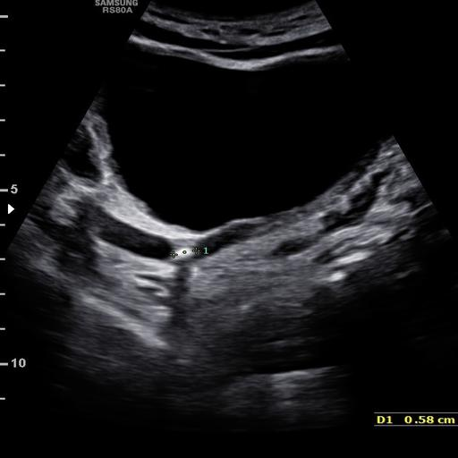</td>
<td></td>
<td>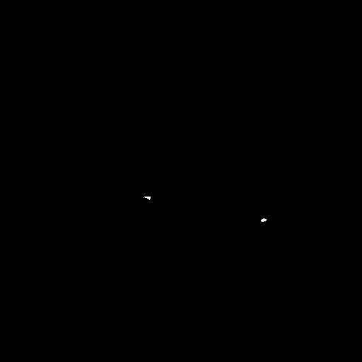</td>
</tr>
<tr>
<td>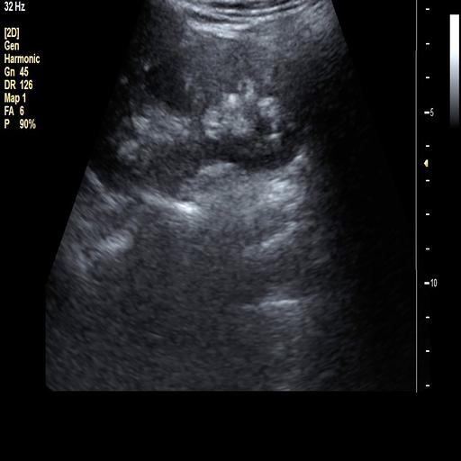</td>
<td>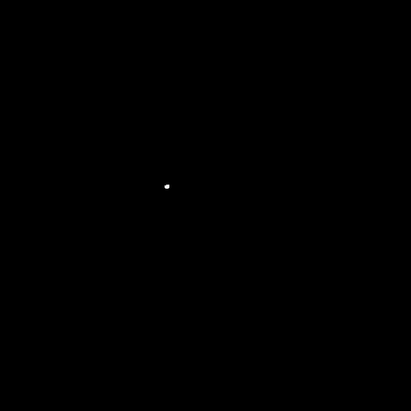</td>
<td></td>
</tr>
 
</table>

 
<h3>1  Dataset Citation</h3>
The dataset used here was derived from   
<b>Stone</b> subset of 
<a href="https://www.kaggle.com/datasets/imtkaggleteam/kidney-stone-classification-and-object-detection">
<b>Kidney Stone | Classification and Object Detection
</b></a> by Mohamadreza Momeni.  
The following explanation was taken from the above web site.  
<b>About Dataset</b> 
 
<b>Datasets – Kidney Stone Detection Project</b> 
This folder contains the raw and processed ultrasound images used in the Kidney Stone Detection Challenge. 
 
<b>Overview</b> 
Total Images: 9,416 
Normal: 4,414 
Stone: 5,002 
Resolution: 512 x 512 pixels 
Format: JPEG / PNG (depending on export) 
Source: Multiple hospitals and scan centers, collected using Samsung ultrasound machines 
(RS85, HS60, RS80A, HS70A).   
<b>License</b> 
<a href="https://creativecommons.org/licenses/by-sa/4.0/">CC BY-SA 4.0</a>
 
 
<b> Important Notes for Annotators</b> 
When labeling kidney stones: 

Look for bright hyperechoic spots. 
Identify acoustic shadows behind stones. 
Avoid confusing stones with normal tissue textures. 
 
<h3>
2 Kidney-Stone-Ultrasound ImageMask Dataset
</h3>
<h3>
2.1 Download ImageMask Dataset
</h3>
 If you would like to train this Kidney-Stone-Ultrasound Segmentation model by yourself,
please down load our dataset <a href="https://drive.google.com/file/d/1qZjyCSRFsi0ZKtVeRDlbJbKN9FbqrO5U/view?usp=sharing">
<b>Augmented-Kidney-Stone-Ultrasound-ImageMask-Dataset.zip</b> 
</a>(<a href="https://creativecommons.org/licenses/by-sa/4.0/">CC BY-SA 4.0</a>) 
 on the google drive,
expand the downloaded, and put it under <b>./dataset/</b> to be:
<pre>
./dataset
└─Kidney-Stone-Ultrasound
    ├─test
    │   ├─images
    │   └─masks
    ├─train
    │   ├─images
    │   └─masks
    └─valid
        ├─images
        └─masks
</pre>
 
<b>Kidney-Stone-Ultrasound Statistics</b> 
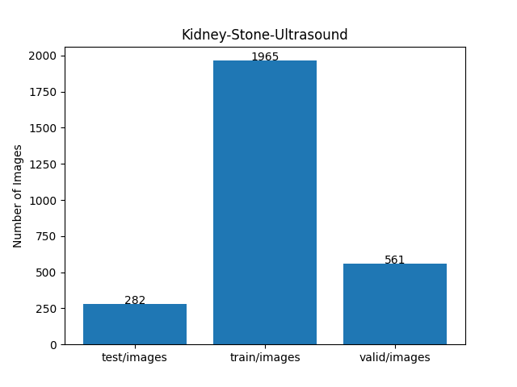 
 
As shown above, the number of images of train and valid datasets is large enough to use for a training set of our segmentation model.
  
<h3>
2.2 Derivation of Kidney-Stone-Ultrasound ImageMask Dataset
</h3>
The folder structure of the original Kidney dataset is the following, but it contains no segmentation (mask) files.
<pre>
./Kidney_dataset
  ├─Normal
  │   ├─Normal_1.JPG
...
  │   └─Normal_4414.JPG
  │   
  └─Stone
        ├─Stone_1.JPG
...
        └─Stone_5002.JPG
</pre>
<b>Step 1</b> 
We generated a 512x512 pixsels master PNG image files from the JPG files in the <b>Stone</b> subset, not including 
<b>Normal</b> subset.
  
<b>Step 2</b> 
We generated the first pseudo masks corresponding to the master images 
by applying an inference (segmentation) method of
the first pretrained model <a href="https://github.com/sarah-antillia/TensorFlow-FlexUNet-Image-Segmentation-Mendeley-Kidney-Stone-Ultrasound">
TensorFlow-FlexUNet-Image-Segmentation-Mendeley-Kidney-Ultrasound
</a> to the master images.
  
<b>Step 3</b> 
We generated the first ImageMask Dataset from the pairs of Stone images and the first 
pseudo masks, by excluding all empty black masks and their corresponding images.
  
<b>Step 4</b> 
We generated the first Augmented ImageMask Dataset from the first ImageMask Dataset 
by using the following image deformation tools. 
<a href="https://github.com/sarah-antillia/Image-Deformation-Tool">Image-Deformation-Tool</a> 
<a href="https://github.com/sarah-antillia/Image-Distortion-Tool">Image-Distortion-Tool</a> 
 
<b>Step 5</b> 
We trained a <a href="https://github.com/sarah-antillia/TensorFlow-FlexUNet-Image-Segmentation-Model">TensorFlowFlexUNet Model</a> 
by using the first Augmented Dataset, and then generated the second pseudo masks corresponding to the master images, 
by applying a segmentation method of the second pretrained FlexUNet model.
  
<b>Step 6</b> 
We generated the second ImageMask Dataset from the pairs of Stone images and the second 
pseudo masks, by excluding all empty black masks and their corresponding images.
  
<b>Step 7</b> 
We finally generated our own  
<a href="">
<b>Augmented-Kidney-Stone-Ultrasound-ImageMask-Dataset.zip</b></a> 
from the second ImageMask Dataset 
by using the following image deformation tools. 
<a href="https://github.com/sarah-antillia/Image-Deformation-Tool">Image-Deformation-Tool</a> 
<a href="https://github.com/sarah-antillia/Image-Distortion-Tool">Image-Distortion-Tool</a> 
 
<h3>
2.3 Train Sample Images and Masks
</h3>
<b>Train sample images</b> 
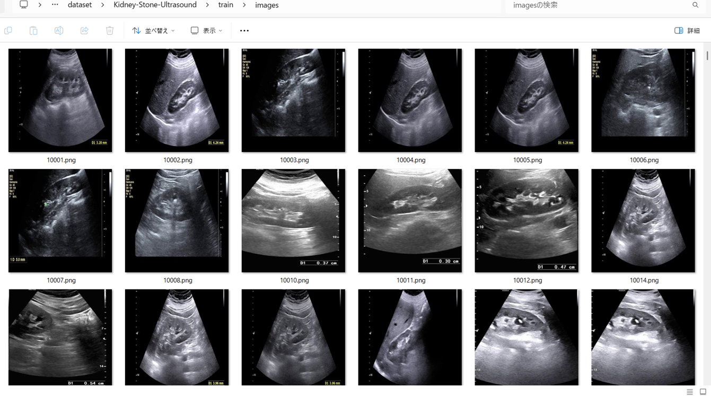
 
<b>Train sample masks</b> 

 
<h3>
3 Train TensorflowFlexUNet Model
</h3>
 We trained Kidney-Stone-Ultrasound TensorFlowFlexUNet Model by using the 
<a href="./projects/TensorFlowFlexUNet/Kidney-Stone-Ultrasound/train_eval_infer.config"> <b>train_eval_infer.config</b></a> file.  
Please move to ./projects/TensorFlowFlexUNet/Kidney-Stone-Ultrasound and run the following bat file. 
<pre>
>1.train.bat
</pre>
, which simply runs the following command. 
<pre>
>python ../../../src/TensorFlowFlexUNetTrainer.py ./train_eval_infer.config
</pre>

<b>Model parameters</b> 
Defined a small <b>base_filters=16</b> and a large <b>base_kernels=(11,11)</b> for the first Conv Layer of Encoder Block of 
<a href="./src/TensorFlowFlexUNet.py">TensorFlowFlexUNet.py</a> 
and a large <b>num_layers=8</b> (including a bridge between Encoder and Decoder Blocks).
<pre>
[model]
image_width    = 512
image_height   = 512
image_channels = 3
input_normalize = True
normalization  = False
num_classes    = 2
base_filters   = 16
base_kernels  = (11,11)
num_layers    = 8
dropout_rate   = 0.05
dilation       = (1,1)
</pre>
<b>Learning rate</b> 
Defined a small learning rate.  
<pre>
[model]
learning_rate  = 0.0001
</pre>
<b>Loss and metrics functions</b> 
Specified "categorical_crossentropy" and "dice_coef_multiclass". 
<pre>
[model]
loss           = "categorical_crossentropy"
metrics        = ["dice_coef_multiclass"]
</pre>
<b >Learning rate reducer callback</b> 
Enabled learing_rate_reducer callback, and a small reducer_patience.
<pre> 
[train]
learning_rate_reducer = True
reducer_factor     = 0.4
reducer_patience   = 4
</pre>
<b>Early stopping callback</b> 
Enabled early stopping callback with patience=10 parameter.
<pre>
[train]
patience      = 10
</pre>
<b>Infer section</b> 
<pre>
[infer] 
images_dir    = "./mini_test/images/"
output_dir    = "./mini_test_output/"
</pre>
<b>RGB color map</b> 
rgb color map dict for Kidney-Stone-Ultrasound 1+1 classes. 
<pre>
[mask]
mask_file_format = ".png"
;Kidney-Stone-Ultrasound 1+1
rgb_map {(0, 0, 0): 0, (255, 255, 255):1}
</pre>
<b>Epoch change inference callbacks</b> 
Enabled epoch_change_infer callback. 
<pre>
[train]
epoch_change_infer     = True
epoch_change_infer_dir =  "./epoch_change_infer"
epoch_change_infer     = False
epoch_change_infer_dir =  "./epoch_change_infer"
num_infer_images =  6
</pre>
By using this <b>epoch_change_infer</b> callback, on every epoch_change, the <b>infer</b> method of the 
<a href="./src/TensorFlowFlexModel.py">TensorFlowFlexModel</a> class 
can be called
 for 6 images in <b>mini_test</b> folder specified in <b>tiledinfer</b> section. This will help you confirm how the predicted mask changes 
 at each epoch during your training process.    
<b>Epoch_change_inference output at starting (1,2,3)</b> 
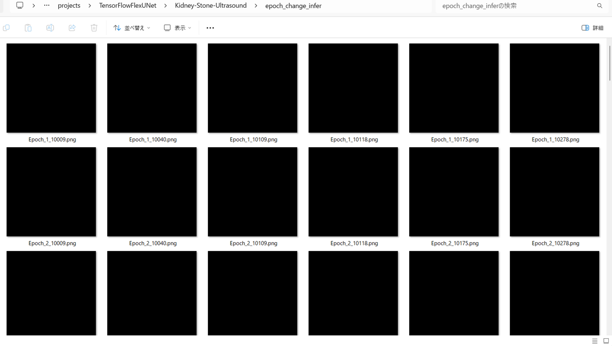 
 
<b>Epoch_change_inference output at ending (11,12,13)</b> 
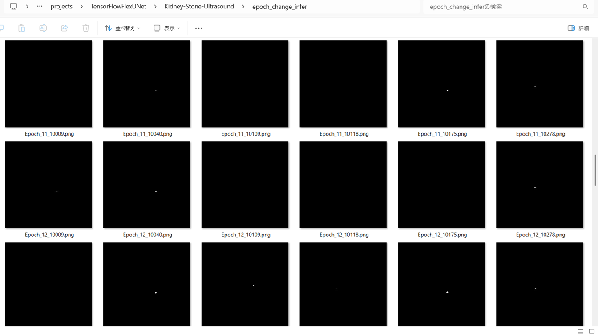 
 
<b>Epoch_change_inference output at ending (23,24,25)</b> 
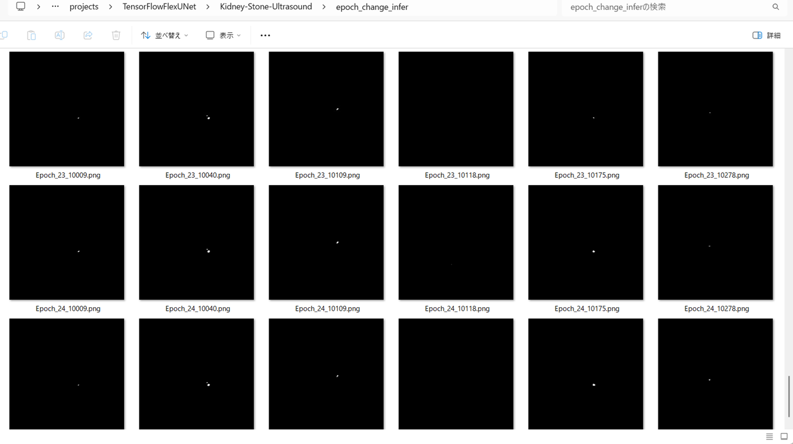 

 
In this experiment, the training process was stopped at epoch 25 by EarlyStoppingCallback.  
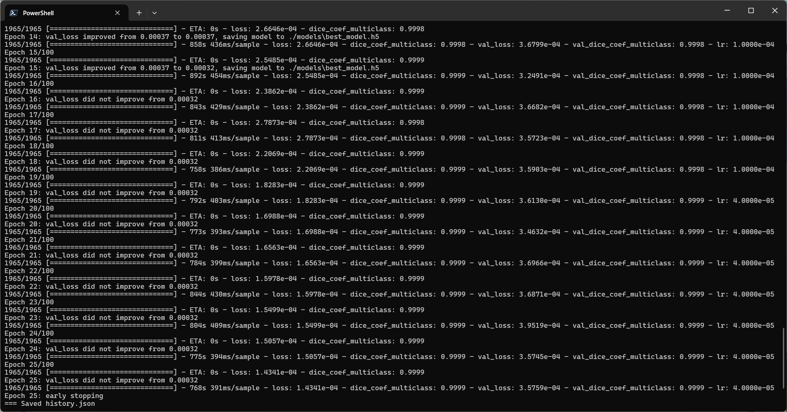 
 
<a href="./projects/TensorFlowFlexUNet/Kidney-Stone-Ultrasound/eval/train_metrics.csv">train_metrics.csv</a> 
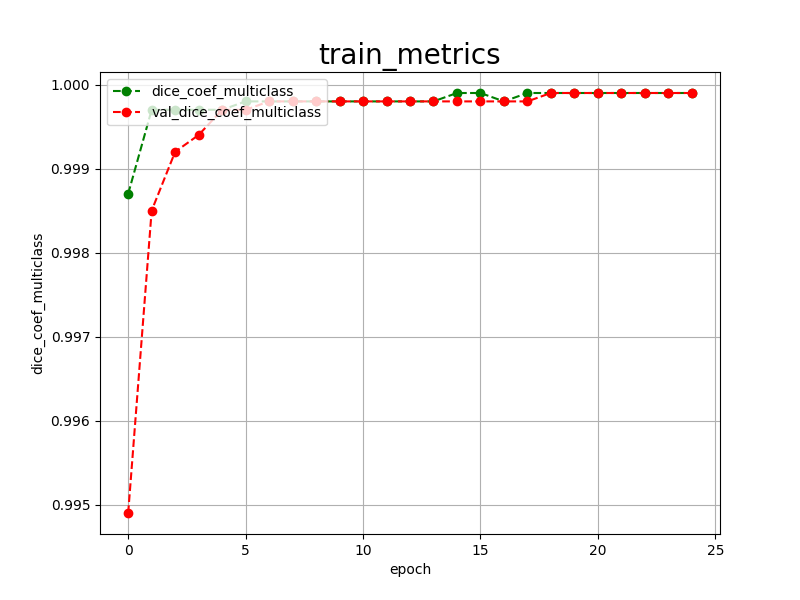 

 
<a href="./projects/TensorFlowFlexUNet/Kidney-Stone-Ultrasound/eval/train_losses.csv">train_losses.csv</a> 
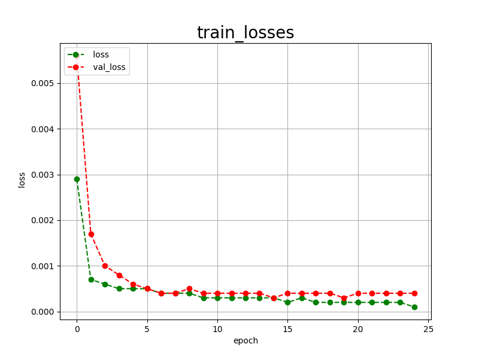 
 
<h3>
4 Evaluation
</h3>
Please move to <b>./projects/TensorFlowFlexUNet/Kidney-Stone-Ultrasound</b> folder, 
and run the following bat file to evaluate TensorflowFlexUNet model for Kidney-Stone-Ultrasound. 
<pre>
>./2.evaluate.bat
</pre>
This bat file simply runs the following command.
<pre>
>python ../../../src/TensorFlowFlexUNetEvaluator.py  ./train_eval_infer.config
</pre>
Evaluation console output: 
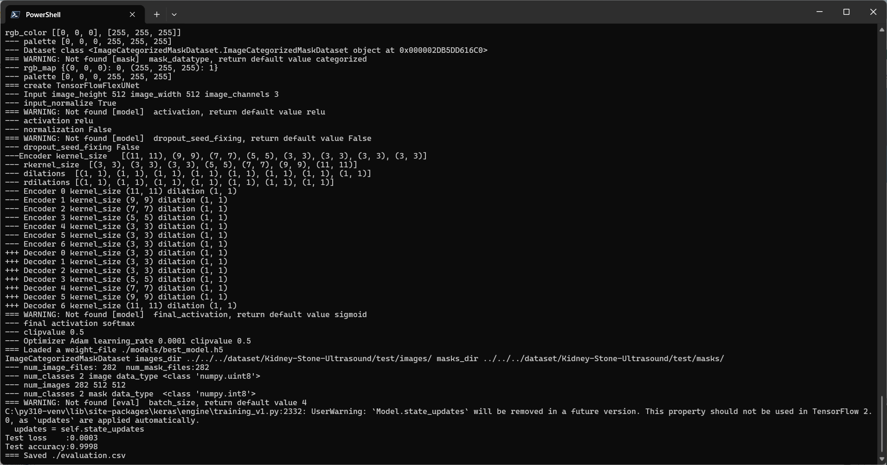
  Image-Segmentation-Kidney-Stone-Ultrasound

<a href="./projects/TensorFlowFlexUNet/Kidney-Stone-Ultrasound/evaluation.csv">evaluation.csv</a> 
The loss (categorical_crossentropy) to the tiledly split <b>Kidney-Stone-Ultrasound/test</b> was very low, and dice_coef_multiclass 
very high as shown below.
 
<pre>
categorical_crossentropy,0.0003
dice_coef_multiclass,0.9998
</pre>
<b>Why was the loss so low and the dice_coef so high in the evaluation scores for the test dataset in this segmentation model? </b> 
The main reason is that the number of black pixels in the Background class is overwhelmingly larger than that of 
white pixels in the Stone class in almost all annotation (mask) data. 
As a result, the Background would be better recognized than the Stone in this multiclass FlexUNet model.
 
<h3>5 Inference</h3>
Please move to <b>./projects/TensorFlowFlexUNet/Kidney-Stone-Ultrasound</b> folder, and run the following bat file to infer segmentation regions for images by the Trained-TensorflowFlexUNet model for Kidney-Stone-Ultrasound. 
<pre>
>./3.infer.bat
</pre>
This simply runs the following command.
<pre>
>python ../../../src/TensorFlowFlexUNetInferencer.py ./train_eval_infer.config
</pre>

<b>mini_test_images</b> 
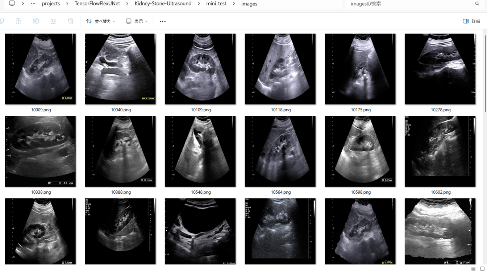 
<b>mini_test_mask(ground_truth)</b> 
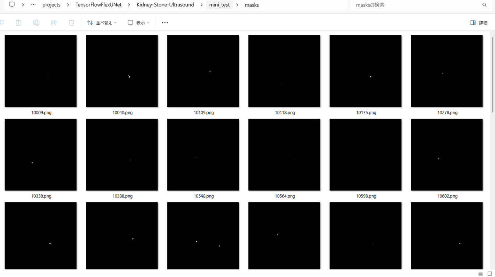 

<b>Inferred test masks</b> 
 
 

<b>Enlarged images and masks for Kidney-Stone-Ultrasound of 512x512 pixels</b> 
As shown below, the inferred masks predicted by our segmentation model trained by the dataset appear similar 
to the ground truth masks, except the fourth case.
 
 
<table>
<tr>
<th>Input: image</th>
<th>Mask (ground_truth)</th>
<th>Prediction: inferred_mask</th>
</tr>
<tr>
<td>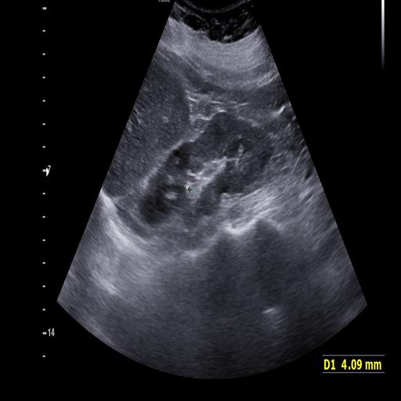</td>
<td></td>
<td></td>
</tr>
<tr>
<td>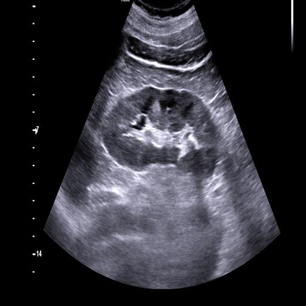</td>
<td>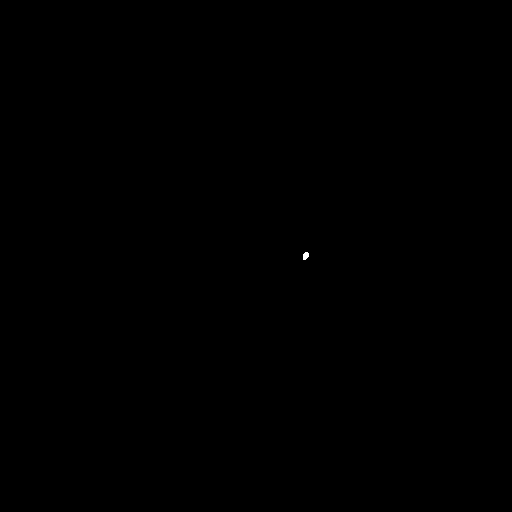</td>
<td></td>
</tr>
<tr>
<td>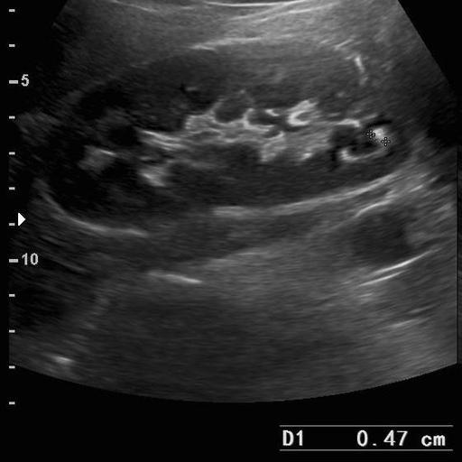</td>
<td></td>
<td>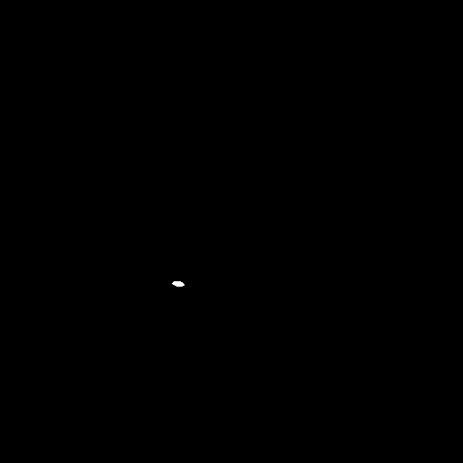</td>
</tr>
<tr>
<td>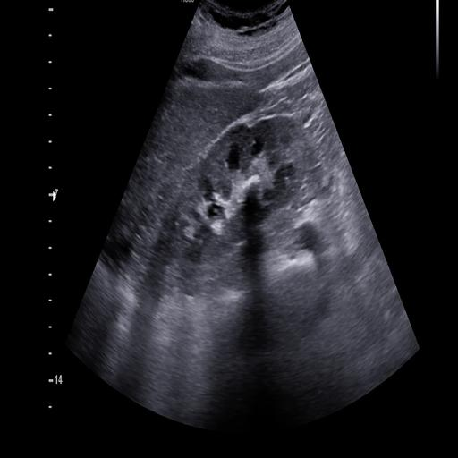</td>
<td>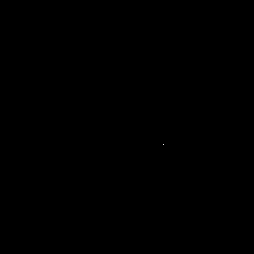</td>
<td></td>
</tr>
<tr>
<td></td>
<td></td>
<td></td>
</tr>
<tr>
<td>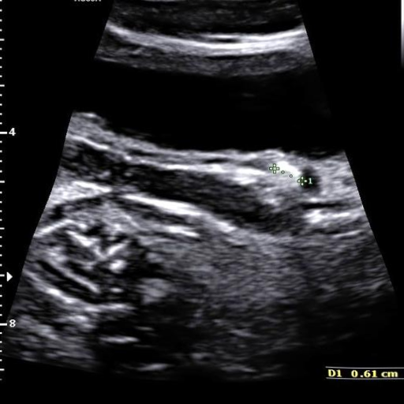</td>
<td></td>
<td>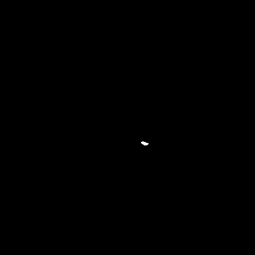</td>
</tr>

</table>

 
<h3>
References
</h3>
<b>1. KSSD2025: A New Annotated Dataset for Automatic Kidney Stone Segmentation and Evaluation With Modified U-Net Based Deep Learning Models</b> 
Murillo F. Murillobouzon; Paulo H. S. de Santana; Gabriel N. Missima; Weverson S. Pereira; Fernando P. Rivera; Gilson A. Giraldi 
<a href="https://ieeexplore.ieee.org/document/11165055">https://ieeexplore.ieee.org/document/11165055</a>
  
<b>2. A deep learning system for automated kidney stone detection and volumetric segmentation on noncontrast CT scans</b> 
Daniel C. Elton, Evrim B.Turkbey, Perry J.Pickhardt, Ronald M.Summers 
<a href="https://www.moreisdifferent.com/assets/my_papers/B_AI_medical_imaging/2022_Z_Elton_Medical_Physics_kidney_stone_detector.pdf">
https://www.moreisdifferent.com/assets/my_papers/B_AI_medical_imaging/2022_Z_Elton_Medical_Physics_kidney_stone_detector.pdf</a>
  
<b>3. TensorFlow-FlexUNet-Image-Segmentation-KSSD2025-Kidney-Stone-CT</b> 
Toshiyuki Arai  
<a href="https://github.com/sarah-antillia/TensorFlow-FlexUNet-Image-Segmentation-KSSD2025-Kidney-Stone-CT">
https://github.com/sarah-antillia/TensorFlow-FlexUNet-Image-Segmentation-KSSD2025-Kidney-Stone-CT
</a>
 
 
<b>4. TensorFlow-FlexUNet-Image-Segmentation-Mendeley-Kidney-Stone-Ultrasound </b> 
Toshiyuki Arai  
<a href="https://github.com/sarah-antillia/TensorFlow-FlexUNet-Image-Segmentation-Mendeley-Kidney-Stone-Ultrasound">
https://github.com/sarah-antillia/TensorFlow-FlexUNet-Image-Segmentation-Mendeley-Kidney-Stone-Ultrasound
</a>
 
 
<b>5. TensorFlow-FlexUNet-Image-Segmentation-Model</b> 
Toshiyuki Arai  
<a href="https://github.com/sarah-antillia/TensorFlow-FlexUNet-Image-Segmentation-Model">
https://github.com/sarah-antillia/TensorFlow-FlexUNet-Image-Segmentation-Model
</a>
 
 
